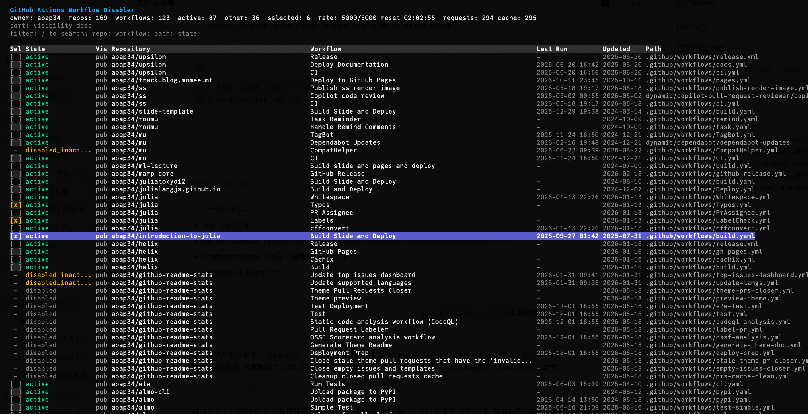

# disable-workflows

A terminal UI for finding GitHub Actions workflows across repositories and disabling them in bulk.

<div align="center">

</div>

## Quick Usage

Scan repositories owned by the authenticated GitHub user:

```sh
disable-workflows
```

Scan an organization or another owner:

```sh
disable-workflows --owner my-org
```

## Install

```sh
go install github.com/abap34/disable-workflows@latest
```

## Authentication

If you already use GitHub CLI, no extra token setup is usually needed.

Token lookup order:

1. The environment variable named by `--token-env` (`GH_TOKEN` by default)
2. `GH_TOKEN`
3. `GITHUB_TOKEN`
4. `gh auth token`

For fine-grained tokens, grant repository read access and Actions write access for the repositories you want to manage.

## TUI Controls

- `up/down` or `j/k`: move cursor
- `space` or `enter`: select an active workflow
- `a`: select all visible active workflows
- `u`: clear selection
- `/`: filter (`repo:api`, `workflow:deploy`, `path:ci.yml`, `state:active`, `all:release`)
- `1`-`7`: sort by visible table columns; press the same number again to flip order
- `[` / `]`: cycle sort column
- `o`: flip sort order
- `d`: disable selected workflows
- `r`: refresh
- `q`: quit

Before sending write requests, the tool asks you to type `disable`.

## Command Line

Common options:

```sh
disable-workflows --owner my-org
disable-workflows --owner my-org --repo api
disable-workflows --owner my-org --max-repos 50
disable-workflows --owner my-org --concurrency 1
disable-workflows --owner my-org --include-archived
```

`--help` for all options.

## Note

- API usage is roughly proportional to the number of repositories and workflows scanned. By default, expect about `repo_count + workflow_count` requests, plus a small number of paginated owner/repository listing requests. Authenticated GitHub API requests usually allow around 5000 requests per hour, so be mindful of rate limits for large owners.
- For repeated use, disable-workflows caches workflow data for `--cache-max-age` (default 5 min) to speed up subsequent runs. Use `--no-cache` or set `--cache-max-age=0` to update cached data from GitHub every time.
